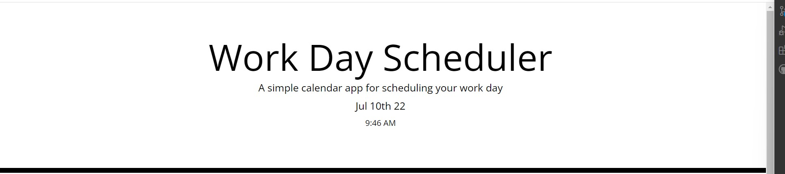
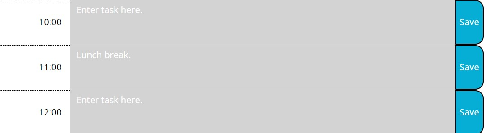
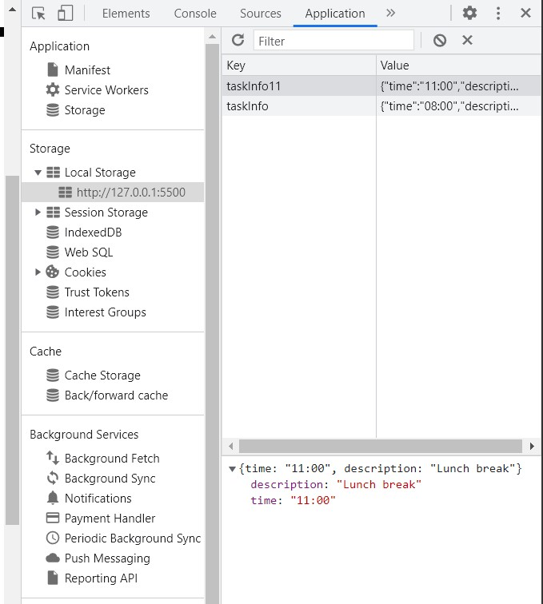
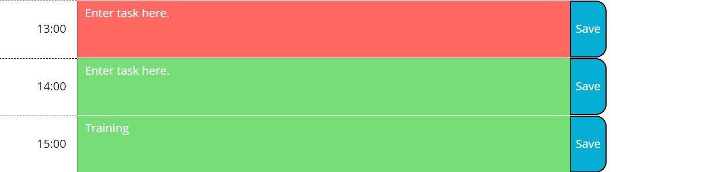

# Work Day Scheduler Starter Code

# Purpose
This application allows users to use a daily planner to create schedule. The application shows the current date and time.
There are also time blocks for standard bunssiness hours (8am to 5pm). Each time block is tell the user wether it is in the past, present or further. 
User is able to enter their tasks and save them in the local storage. 
When the page is refreshed the events still persit.
User is able to edit the events and save them. 

# Feature
- Current date and time are showed in the header.

- Time Blocks for bussiness hours 8am to 5pm

- Past color 

-

- Present color

-

- Future color

-

- Event is saved in local storage

-

- Edit event 

-

# Built with 
* HTML
* CSS
* JavaScript

# 3rd Pary API
* Bootstrap
* moment.js

# Deployemt

To deploy this project go to: https://moniquemeas.github.io/work-day/

# Contribute

Monique Meas

